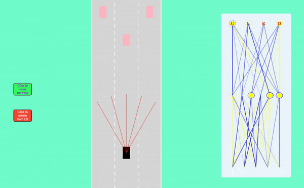

# Self Driving Car Simulator

### This is a Javascript simulator which implements a two-layer neural network to make a self driving car, with features like - 
  - Adding traffic cars
  - Modifying road width and lanes
  - Training neural network against all scenarios

## Detailed feature description : 
  - ### Car Physics
    - The car operates like a video game car, with 4-directional motion using arrow keys.
    - It has a 2 layer neural network completely implemented from scratch using Javascript.
    - Has functionality to store the best network configuration.
  

